# Multica Best Practices

[中文](./README.md) | English

> A highly reusable super-individual orchestration flow — from PRD to CICD.
> Practical Agent · Squad · Skill · Issue templates for [Multica](https://github.com/multica-ai/multica).
> **Copy. Paste. Run.** — copy and it works; or build the whole squad with one command.

This repo turns everything a requirement needs to travel from Issue to production — **roles, workflow, gates, platform integration** — into copy-ready config. You don't write prompts from scratch: copy a Starter → fill the platform shells' `.env` → run a real task, then tailor to your team.

> **Background**: many teams keep rebuilding the "requirement → design → implementation → test → deploy" loop on Multica, and hard-code Confluence / Jira / Jenkins / Figma URLs and credentials into prompts — so switching company or platform means rewriting everything.
> The core idea here: **platforms live only inside `multica-platform-*` shells; role prompts only say "which skill to use"**. Skills mount by name, so a team just fills the shells to reuse. Every template is validated on real tasks and published as "Copy. Paste. Run.".


## What this is

In one sentence: **a set of Multica squad configurations continuously refined through real tasks** — each agent owns one thing, the Leader owns orchestration and gatekeeping, and every step must produce evidence.

```text
You create: Agents (roles) + Squad (orchestration) + Skills (practices) + Issue (task)
                  ↓
       Leader runs the squad: converge (G0) → design → implement → unit test → deploy → automated testing
                  ↓
   Gate each step (rerun via the multica-verification skill) → Human final acceptance
   ```

   ## Roles & responsibilities (Agent Matrix)

   | Agent | Should do | Should NOT do |
   | --- | --- | --- |
   | Architect | Design the solution | Write lots of code |
   | FrontendDev | Frontend implementation (works with the UI design) | Change requirements / self-approve / invent APIs |
   | BackendDev | Backend implementation + API contract | Change requirements / self-approve / touch UI |
   | Tester | T1/T2 cases & coverage / T3 post-deploy automation | Change requirements / run automation before G2.5 |
   | DevOps | Trigger CI/CD after G2, return deploy URL | Write business code / self-claim deploy success |
   | Reviewer | Business review (design / critical changes) | Replace objective verification / replace human acceptance |
   | Leader | Orchestration and gatekeeping (multica-verification skill) | Implement personally / rubber-stamp itself |

   > Note: the `software-development-reviewed` Starter adds dedicated Reviewers (ArchReviewer / DesignReviewer / ProductReviewer / FrontendReviewer / BackendReviewer / TestReviewer) for every regular producing role except Leader and DevOps; see Starters and [gates-and-evidence](docs/en_US/gates-and-evidence.md#two-layer-gate-generic-gate--professional-artifact-review).

   ## Starters

   | Starter | Use | Status |
   | --- | --- | --- |
   | [Software Development (Reviewed)](./templates/squad/software-development-reviewed/README.md) | Recommended main flow: dedicated Reviewer per regular role and a two-layer gate (generic gate + professional artifact review) | Recommended |
   | [Software Development](./templates/squad/software-development/README.md) | Lightweight alternative: frontend/backend routed by scope; any role can be missing, single-layer generic gate (no professional review) | Optional |
   | [Bug Fix](./templates/squad/bug-fix/README.md) | Root cause / fix / regression (routed by impact, skips Architect) | Experimental |

   More starters (Technical Research, etc.) will be added after being validated on real tasks. **Don't pretend best practices are finished.**

   ## New-project quick check

   | Question | Answer |
   | --- | --- |
   | **We don't use JIRA / Confluence — can we still use these templates?** | Yes. The `squad.md` + agent instructions are the core; they have no platform dependency. Content-layer skills (`multica-backend-impl`, `multica-technical-design`, etc.) work without any platform skill — the Leader provides links in dispatch, agents read them directly. Platform skills are optional automation enhancers: mount them when you want the agent to fetch/publish automatically; leave them unmounted when you don't. |
   | **What is the minimum to get started?** | 1 Leader (squad.md injected) + 1 implementing role (e.g. @BackendDev). No skills required at all — agent instructions already embed the full behavior. Add skills one at a time as the need arises. |
   | **Is the T1/T2/T3 test structure mandatory?** | No. It is a methodology for teams with a dedicated Tester. If you have no Tester or no automated testing, skip it entirely — nothing in the core flow depends on it. |
   | **Do I need all 24 skills?** | No. Skills mount per-agent on demand. Start with the minimum skill table in Step 2. Mount additional skills only when that agent's need for that capability arises. |

   ## Repository structure

   ```text
   AGENTS.md     ⭐ Agent entry: project conventions & change rules
   templates/  ⭐ Start here: all copy-ready config
   ├── agents/           Shared Agent Instructions (15 role defs: 9 regular + 6 dedicated Reviewers)
   ├── skills/           Shared Skills (24, grouped by role: architect / backend / designer / devops / frontend / leader / platform / product-manager / reviewer / tester; see skills/README.md for the four-layer model)
   └── squad/            Squad starters
       ├── software-development/  Regular development (squad / issue / README incl. workflow)
       ├── software-development-reviewed/  Recommended main flow: dedicated Reviewer per role + two-layer gate
       └── bug-fix/              Minimal fix combination (only the orchestration changes)
   docs/          ⭐ Read this first: where instructions go / gates & evidence / common mistakes / adapt & scale
   ├── zh_CN/              Chinese methodology
   └── en_US/              English methodology
   scripts/       ⚙️ Optional automation: push templates to Multica in one shot (squad / agents / skills / bindings)
   └── multica-sync/       Python 3.9+, stdlib only, fully idempotent; see scripts/multica-sync/README.md
   ```

   ## Full flow at a glance

The complete chain from a requirement coming in as an Issue to tests passing (based on `templates/squad/software-development-reviewed`, the two-layer-gate main flow; `software-development` is the lightweight alternative without professional review):

```mermaid
flowchart TB
    IN([Requirement / Idea / Issue in])

    subgraph P0["Phase 0: requirement convergence & G0"]
        direction TB
        L0["@Leader<br/>reads Issue, finds the source of truth"]
        PM["@ProductManager (optional)<br/>multica-pm-requirement-spec<br/>+ multica-pm-artifact-publish"]
        REQ[/"Requirement source of truth<br/>PRD or existing Issue<br/>G- FR- BR- AC- OP- RISK-"/]
        SCOPE["@Leader<br/>scope, roles present, routing<br/>declare deploy branch"]
        OP{"OP- closed & scope clear?"}
        CLARIFY["Human / @ProductManager<br/>fill gaps & open questions"]
        G0["G0 human confirmation<br/>scope, business rules, roles"]

        L0 --> PM --> REQ
        REQ --> SCOPE --> OP
        OP -->|"no"| CLARIFY --> SCOPE
        OP -->|"yes"| G0
    end

    subgraph P1["Phase 1: design, test shift-left & G1"]
        direction TB
        ARCH["@Architect (optional)<br/>multica-technical-design<br/>+ multica-artifact-architect"]
        DESIGNER["@Designer (optional)<br/>multica-design-ui-impl"]
        T1["@Tester T1 (optional)<br/>multica-test-t1-design<br/>+ multica-test-orchestration"]
        R1["@ProductReviewer / @ArchReviewer / @DesignReviewer (optional)<br/>G1 professional artifact review<br/>(requirements / technical design / UI reviewed independently)"]
        V1["@Leader<br/>multica-verification<br/>check design vs AC-"]
        G1{"G1 pass?"}
        FIX1["return to design role<br/>max 2 reworks"]

        ARCH --> R1
        DESIGNER --> R1
        T1 --> R1
        R1 --> V1 --> G1
        G1 -->|"FAIL"| FIX1 --> R1
    end

    subgraph P2["Phase 2: contract-first, parallel impl & G2"]
        direction TB
        API["@BackendDev (optional)<br/>publish API contract first<br/>multica-artifact-backend"]
        BDEV["@BackendDev (optional)<br/>multica-backend-impl"]
        FDEV["@FrontendDev (optional)<br/>depends on UI + API contract<br/>multica-frontend-impl"]
        APICASE["@Tester (optional)<br/>write API cases in parallel<br/>multica-test-orchestration"]
        SELF["dev self-check<br/>multica-verification"]
        R2["@FrontendReviewer / @BackendReviewer (optional)<br/>G2 professional artifact review<br/>(frontend / backend reviewed independently)"]
        V2["@Leader<br/>multica-verification<br/>rerun impl evidence"]
        G2{"G2 pass?"}
        FIX2["return to dev role<br/>with failure evidence"]
        PUSH["merge to deploy branch & push"]

        API --> BDEV
        API --> FDEV
        API --> APICASE
        BDEV --> SELF
        FDEV --> SELF
        APICASE --> R2
        SELF --> R2 --> V2 --> G2
        G2 -->|"FAIL"| FIX2 --> SELF
        G2 -->|"PASS"| PUSH
    end

    subgraph P25["Phase 2.5: coverage, CI/CD & deploy"]
        direction TB
        T2["@Tester T2 (optional)<br/>multica-test-t2-coverage<br/>coverage vs AC-"]
        DEVOPS["@DevOps (optional)<br/>multica-artifact-cicd-sync<br/>(calls multica-platform-* shell)"]
        DISCOVER["discover-only<br/>copy last good params, change branch"]
        READY{"discover ready?"}
        CICD["trigger CI/CD build & deploy<br/>(platform by shell)"]
        DEPLOY[/"CI/CD evidence<br/>Build URL + log + env URL"/]
        G25["G2.5 @Leader gate<br/>verify deploy evidence"]
        FIX25["BLOCKED / FAIL<br/>fix params, pipeline, or dev"]

        DEVOPS --> DISCOVER --> READY
        READY -->|"no"| FIX25 --> DEVOPS
        READY -->|"yes"| CICD --> DEPLOY --> G25
    end

    subgraph P3["Phase 3: live automation & G3"]
        direction TB
        T3["@Tester T3 (optional)<br/>in: T1 + API cases + T2 + env URL<br/>multica-test-t3-ui-automation"]
        RT["@TestReviewer (optional)<br/>G3 test review"]
        REPORT[/"Test report<br/>logs + AC- per item<br/>PASS / FAIL / BLOCKED"/]
        V3["@Leader<br/>multica-verification<br/>review test evidence"]
        G3{"G3 pass?"}
        FAIL3["FAIL: defect & return to dev"]
        BLOCK3["BLOCKED: fix env/data/access"]

        T3 --> RT --> REPORT --> V3 --> G3
        G3 -->|"FAIL"| FAIL3
        G3 -->|"BLOCKED"| BLOCK3
    end

    subgraph P4["Phase 4: human acceptance"]
        direction TB
        G4["G4 human acceptance<br/>value, risk, final release"]
        DONE([tests pass / mergeable / Done])
        REJECT["reject: rework by owner role"]
        ESC["escalate to human<br/>rework>2 / risk / conflict"]

        G4 -->|"pass"| DONE
        G4 -->|"reject"| REJECT
        REJECT -. "escalation" .-> ESC
    end

    IN --> L0
    G0 -. "scope has design" .-> ARCH
    G0 -. "scope has UI" .-> DESIGNER
    G0 -. "tester present, start T1" .-> T1
    G1 -->|"PASS"| API
    G1 -. "frontend-only, skip contract" .-> FDEV
    PUSH --> T2
    PUSH --> DEVOPS
    T2 --> T3
    G25 -->|"PASS"| T3
    G25 -->|"FAIL"| FIX25
    G3 -->|"PASS"| G4

    classDef terminal fill:#1f2937,color:#fff,stroke:#111827,stroke-width:2px;
    classDef role fill:#e8f5e9,color:#173b1b,stroke:#2e7d32,stroke-width:1.5px;
    classDef artifact fill:#f3e5f5,color:#3b1742,stroke:#8e24aa,stroke-width:1.5px;
    classDef gate fill:#ffebee,color:#56151b,stroke:#c62828,stroke-width:2px;
    classDef human fill:#eeeeee,color:#222,stroke:#616161,stroke-width:1.5px;
    classDef action fill:#fff8e1,color:#3d3100,stroke:#b58500,stroke-width:1.2px;

    class IN,DONE terminal;
    class L0,PM,SCOPE,ARCH,DESIGNER,T1,R1,V1,API,BDEV,FDEV,APICASE,SELF,R2,V2,T2,DEVOPS,T3,V3 role;
    class REQ,DEPLOY,REPORT artifact;
    class OP,G0,G1,G2,READY,G25,G3,G4 gate;
    class CLARIFY,ESC human;
    class FIX1,FIX2,PUSH,DISCOVER,CICD,FIX25,FAIL3,BLOCK3,REJECT action;
```



> Key constraints: ① every gate is independently rerun by the Leader via `multica-verification` (never trust member self-reports); ② T3 **must** dispatch only after G2.5 PASS; ③ external tools (Confluence / JIRA / Jenkins / Figma / test-case platforms) are plugged in replaceably through the orchestration-layer skills (`multica-artifact-*` series, etc.) and `multica-platform-*` shells — the public repo ships placeholders only; ④ once any artifact changes, its downstream gates go stale and must be re-run.

## 5-minute quick start

### Prerequisites

A **Multica environment** where you can create Agents / Squads / Skills / Issues.
Don't have one yet? Read the [Multica docs](https://www.multica.ai/docs) or [How Multica works](https://www.multica.ai/docs/how-multica-works) (3 minutes).

Two paths — **pick one**:

| Mode | What you do | Time | Good for |
| --- | --- | --- | --- |
| **Mode A · automatic** | Run one command; the whole squad is built | ~1 min | Getting it running in your own workspace |
| **Mode B · manual** | Copy-paste through Step 1–3 | ~5 min | Just browsing the templates, or taking one or two files |

Steps 4–6 (create Issue → assign → run) are **shared** by both modes.

---

### Mode A — Automatic (scripts, recommended)

[`scripts/multica-sync`](./scripts/multica-sync) pushes this repo's templates to your workspace in one shot:
**import skills → create/update agents → create squad → add members → bind skills**.
It is idempotent (re-runnable), joins everything **by name** (no UUIDs to fill in), and needs only the Python 3.9+ standard library.

**macOS / Linux (Bash/Zsh):**

```bash
cd scripts/multica-sync

export MULTICA_API_TOKEN="mul_xxx"                           # your API token
export MULTICA_API_URL="https://your-multica.example.com"   # your Multica URL

python multica.py init --workspace 100 --dry-run   # preview first (optional)
python multica.py init --workspace 100             # one command builds everything
```

**Windows (PowerShell):**

```powershell
cd scripts/multica-sync

$env:MULTICA_API_TOKEN = "mul_xxx"                           # your API token
$env:MULTICA_API_URL   = "https://your-multica.example.com"  # your Multica URL

python multica.py init --workspace 100 --dry-run   # preview first (optional)
python multica.py init --workspace 100             # one command builds everything
```

That's it — it uses the bundled `squad-bootstrap.example.json` (15 roles with their skills) by default.
To customise roles or mounts, copy it first:

```bash
# Bash/Zsh
cp squad-bootstrap.example.json squad-bootstrap.json
python multica.py init --workspace 100 --config squad-bootstrap.json
```

```powershell
# PowerShell
cp squad-bootstrap.example.json squad-bootstrap.json
python multica.py init --workspace 100 --config squad-bootstrap.json
```

> Mode A already covers Steps 1–3; jump straight to **Step 4 — Create the Issue**.
> For partial syncs, exact binding replacement or a specific runtime, see [`scripts/multica-sync/README.md`](./scripts/multica-sync/README.md).

---

### Mode B — Manual (copy-paste)

👉 **[`templates/squad/software-development-reviewed/README.md`](./templates/squad/software-development-reviewed/README.md)** (lightweight no-professional-review variant: [`software-development`](./templates/squad/software-development/README.md))

You get:

- 1 Squad Leader (orchestration + gatekeeping)
- 15 Agents: the main-flow `software-development-reviewed` includes 6 dedicated `*-reviewer` agents (ArchReviewer / DesignReviewer / ProductReviewer / FrontendReviewer / BackendReviewer / TestReviewer); the lightweight `software-development` is 9 Agents (single `Reviewer`)
- 24 Skills (copy as needed; `multica-verification` is the mandatory gatekeeping Skill, minimum set in the table below)
- 1 Issue template (with the "affected ends" scope declaration; source supports "linked / fully self-contained" — pick one)
- 1 squad workflow (the `software-development-reviewed` reviewed flow with per-role dedicated reviewers; `software-development` is the lightweight variant where any role can be missing, incl. G2.5 CI/CD)

#### Step 1 — Create Agents

In Multica, create Agents. Naming follows [`docs/en_US/naming-conventions.md`](./docs/en_US/naming-conventions.md). Copy the code block from the matching file under [`templates/agents/`](./templates/agents/) into each Agent's Instructions.

The recommended main-flow configuration (`software-development-reviewed`) includes 15 Agents:

**Core 9 roles (in all Starters):**

| Agent | Copy |
| --- | --- |
| Leader | `leader.md` (injected by Squad Instructions, usually no separate Agent needed) |
| ProductManager | `product-manager.md` |
| Architect | `architect.md` |
| Designer | `designer.md` |
| FrontendDev | `frontend-developer.md` |
| BackendDev | `backend-developer.md` |
| Tester | `tester.md` |
| Reviewer | `reviewer.md` |
| DevOps | `devops.md` |

**Dedicated Reviewers × 6 (main-flow `software-development-reviewed` only; optional for lightweight `software-development`):**

| Agent | Copy |
| --- | --- |
| ProductReviewer | `product-reviewer.md` |
| ArchReviewer | `arch-reviewer.md` |
| DesignReviewer | `design-reviewer.md` |
| FrontendReviewer | `frontend-reviewer.md` |
| BackendReviewer | `backend-reviewer.md` |
| TestReviewer | `test-reviewer.md` |

> The lightweight `software-development` starter requires only the core 9. `leader.md` does not need a separate Agent: Squad Instructions only inject the Leader, and `squad.md` is its behavior config. ProductManager is optional — dispatched by the Leader only when the requirement has no ready-scope marker.

#### Step 2 — Create Skills

In Multica, create the Skills below, copying the code block from the matching `SKILL.md`:

| Skill | Source | Mount to |
| --- | --- | --- |
| `multica-verification` (gatekeeping, required) | [`templates/skills/leader/multica-verification/SKILL.md`](./templates/skills/leader/multica-verification/SKILL.md) | **Leader** |
| `multica-pm-requirement-spec` | [`templates/skills/product-manager/multica-pm-requirement-spec/SKILL.md`](./templates/skills/product-manager/multica-pm-requirement-spec/SKILL.md) | Leader / Architect |
| `multica-technical-design` | [`templates/skills/architect/multica-technical-design/SKILL.md`](./templates/skills/architect/multica-technical-design/SKILL.md) | Architect |
| `multica-pm-artifact-publish` | [`templates/skills/product-manager/multica-pm-artifact-publish/SKILL.md`](./templates/skills/product-manager/multica-pm-artifact-publish/SKILL.md) | ProductManager (lands artifacts to the requirement platform) |
| `multica-design-ui-impl` | [`templates/skills/designer/multica-design-ui-impl/SKILL.md`](./templates/skills/designer/multica-design-ui-impl/SKILL.md) | Designer (lands artifacts to the design platform) |
| `multica-artifact-architect` | [`templates/skills/architect/multica-artifact-architect/SKILL.md`](./templates/skills/architect/multica-artifact-architect/SKILL.md) | Architect (lands artifacts to Git / knowledge platform) |
| `multica-artifact-backend` | [`templates/skills/backend/multica-artifact-backend/SKILL.md`](./templates/skills/backend/multica-artifact-backend/SKILL.md) | BackendDev (lands artifacts to the API platform) |
| `multica-artifact-cicd-sync` | [`templates/skills/devops/multica-artifact-cicd-sync/SKILL.md`](./templates/skills/devops/multica-artifact-cicd-sync/SKILL.md) | DevOps (triggers CI/CD deploy) |
| `multica-platform-jenkins` | [`templates/skills/platform/multica-platform-jenkins/SKILL.md`](./templates/skills/platform/multica-platform-jenkins/SKILL.md) | platform-layer shell (CI/CD system) |
| `multica-platform-github-actions` | [`templates/skills/platform/multica-platform-github-actions/SKILL.md`](./templates/skills/platform/multica-platform-github-actions/SKILL.md) | platform-layer shell (GitHub Actions) |

> All skills live under `templates/skills/` with the unified `multica-` prefix, in four layers: **content** (multica-pm-requirement-spec / multica-technical-design / multica-backend-impl / multica-frontend-impl / multica-test-t1-design and -t2 / -t3); **orchestration** (`multica-artifact-*` + `multica-test-orchestration`, landing artifacts to team platforms — platform is swappable); **platform-layer shell** (multica-platform-*, the only place allowed to hold company-internal URL/credential placeholders — all optional); **review** (`multica-review-*` + `multica-verification`). Role prompts only say "which skill to use", never a platform name. See `docs/en_US/role-skills-architecture.md` for the four-layer model. Skills mount **by name**.

#### Step 3 — Create the Squad

Create a Squad and copy `templates/squad/software-development-reviewed/squad.md` into the Squad Instructions (for the lightweight alternative use `software-development/squad.md`).

### Step 4 — Create the Issue

Copy `templates/squad/software-development-reviewed/issue.md` into a new Issue: if requirements already live in Jira/Tapd, pick "External link" and fill only the link + affected ends; otherwise pick "Fully self-contained" and fill everything.

### Step 5 — Assign

Assign the Issue to this Squad.

### Step 6 — Run

During implementation, dispatch API test cases in parallel as soon as the API contract is ready; the test report follows the relevant implementation and API-test gates.

```text
Issue → [Design] → [API contract ∥ feature cases] → [Frontend ∥ Backend implementation] → [G2.5 CI/CD deploy] → [T3 testing] → Human
```

The Leader gatekeeps every artifact with the multica-verification skill; only PASS moves to the next stage. Roles outside the scope are skipped; design and critical changes get a business review from the Reviewer; after G2, DevOps triggers CI/CD (G2.5), and the Tester runs automation in that deploy env (T3).
That's it. Run one real requirement, then tune it to your team.

## Where does an instruction go?

| I want to tell the agent… | Put it in |
| --- | --- |
| "What we're doing this time" | Issue |
| "What background does this project have" | Project Instructions |
| "What role are you" | Agent Instructions |
| "Who is responsible for what" | Squad Instructions |
| "How to do a certain kind of check" | Skill |
| "Tests must pass" | CI (engineering system) |
| "Who decides what ships" | Human |

```text
Issue   = What are we doing?
Project = What should we know?
Agent   = What is my job?
Squad   = Who does what?
Skill   = How do I do it?
CI / PR = What must actually pass?
```

## Principles

1. Keep agent responsibilities narrow.
2. Don't copy routing logic into every Agent.
3. Let the Squad Leader do the coordination.
4. Never let the completer approve their own work (the gatekeeping action is standardized as the multica-verification skill, executed by the non-producing Leader or CI).
5. Require evidence instead of a verbal "it's done".
6. Don't use natural-language instructions as hard constraints.
7. Try a simple flow before a complex multi-agent one.
8. Retry on transient failures.
9. Restart a new session on wrong direction; don't push through.
10. Keep human approval at important irreversible boundaries.

> **Instructions are guidance, not a safety boundary.** Rules that must be obeyed live outside the LLM: tests, lint, build, CI, branch protection, PR approval. Don't rely on "the agent was asked not to do this."

## Two gate modes

Every Squad workflow in this repo uses the "stage gate + evidence" framework, but gate depth comes in two modes, chosen by how much assurance you need:

| Mode | Gate layers | Review trigger | Use |
| --- | --- | --- | --- |
| Lightweight alternative (software-development / bug-fix) | 1: Leader generic gate (multica-verification skill) | G1 single-point business review only | general collaboration, early phase, no strong assurance need |
| Recommended main flow (software-development-reviewed) | 2: generic gate + per-role dedicated Reviewer professional review | Leader dispatches dedicated Reviewer after generic-gate PASS | high professional bar, artifacts must be defensible |

**How the two layers run** (strengthened mode): producing role finishes → Leader reruns multica-verification on acceptance/process ("correct?") → after PASS, dispatch the dedicated Reviewer with multica-review-* for professional analysis ("professional?") → release only on review PASS; on FAIL the dedicated Reviewer reports to Leader, who dispatches the author to fix, then re-reviews — max 3 rounds, still FAIL → escalate to human. Either layer FAIL returns; rounds counted independently but share the "3-strike cap".

Dedicated Reviewers map one-to-one to producing roles (architecture / UI / requirements / frontend / backend / testing), don't modify on the author's behalf, and report to the Leader; Leader and DevOps get no dedicated Reviewer. See [gates-and-evidence](docs/en_US/gates-and-evidence.md#two-layer-gate-generic-gate--professional-artifact-review).

Details:

| Doc | Content |
| --- | --- |
| [where-to-put-things](docs/en_US/where-to-put-things.md) | Where instructions belong — cheat sheet (most worth reading) |
| [FLOW](docs/en_US/FLOW.md) | Deliverable-driven end-to-end flow and gate trimming (5 diagrams + work-package table + three trims) |
| [role-skills-architecture](docs/en_US/role-skills-architecture.md) | The four skill layers (content / orchestration / platform / review) and the inventory |
| [artifact-conventions](docs/en_US/artifact-conventions.md) | Collaboration artifact conventions: content spec + sync skill (platforms are not written into role prompts; they sink into the orchestration-layer skills, e.g. `multica-artifact-*`, and are swappable per company) |
| [platform-collaboration](docs/en_US/platform-collaboration.md) | Platform capability written once: URLs / credentials / REST details exist only in `multica-platform-*` |
| [gates-and-evidence](docs/en_US/gates-and-evidence.md) | Gates G0–G4 (+G2.5 CI/CD) and evidence requirements |
| [cicd-and-test-pipeline](docs/en_US/cicd-and-test-pipeline.md) | CI/CD and test-pipeline methodology (G2.5, Tester three-phase, deploy branch) |
| [test-automation-in-repo](docs/en_US/test-automation-in-repo.md) | Automation assets in the repo: paths come only from `MULTICA.md` at the product repo root |
| [multi-repo-and-issue-links](docs/en_US/multi-repo-and-issue-links.md) | Multi-repo matrix routing and mandatory upstream reads of linked Issues |
| [common-mistakes](docs/en_US/common-mistakes.md) | Bad → Good examples |
| [adapt-and-scale](docs/en_US/adapt-and-scale.md) | Cut down, extend, pilot, roll out |
| [naming-conventions](docs/en_US/naming-conventions.md) | Agent naming rules (role + project + member-id) |

## Relationship to related projects

| Project | Relationship |
| --- | --- |
| [Multica](https://github.com/multica-ai/multica) | The runtime and collaboration foundation (Issue, Agent, Squad, Runtime) |
| [multica-agent-workflow-template](https://github.com/wksudud/multica-agent-workflow-template) | Methodology on Agent/Skill count and routing design; can be used together |
| [oh-my-multica](https://github.com/xiaohei-info/oh-my-multica) | Production-grade deterministic DAG / Loop; this repo focuses on the Squad and gate-convention layer |

## Contributing

Please don't submit "sounds nice" prompts. A valuable contribution includes:

1. The problem it solves
2. The scenarios it fits
3. The complete template
4. At least one real example
5. Known failure cases

Real-world experience is worth more than prompt complexity. See [CONTRIBUTING.md](CONTRIBUTING.md).

## Resources

- [Multica GitHub](https://github.com/multica-ai/multica)
- [Multica docs](https://www.multica.ai/docs)
- [How Multica works](https://www.multica.ai/docs/how-multica-works)
- [Agents](https://www.multica.ai/docs/agents)
- [Squads](https://www.multica.ai/docs/squads)
- [Tasks](https://www.multica.ai/docs/tasks)

## Security

Read [SECURITY.md](SECURITY.md) before sharing configs: never upload tokens, absolute paths, or real workspaces / emails.

## License

[MIT](LICENSE)

## Friends

- [LinuxDo](https://linux.do)
